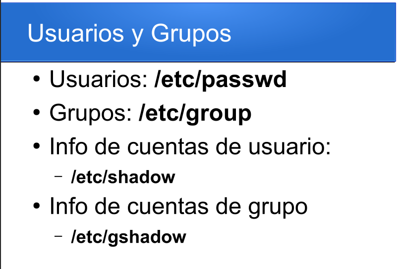
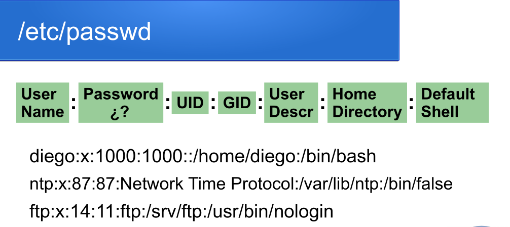
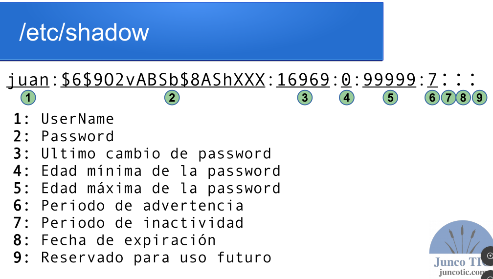
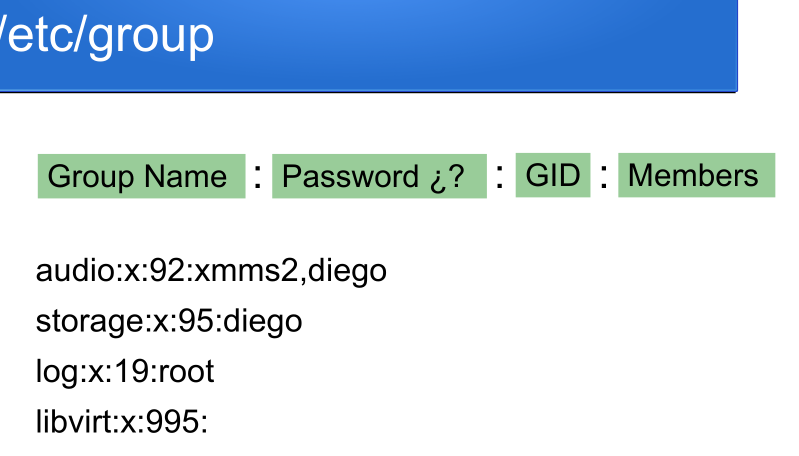
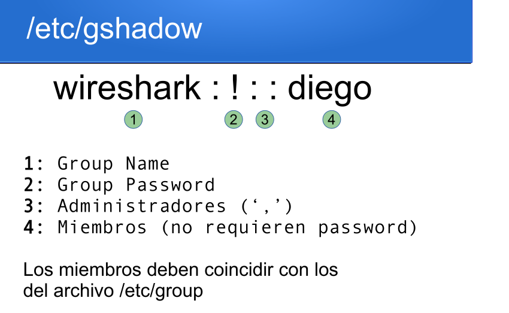

# Administración de Usuarios y Procesos en Linux

##  Comandos de Superusuario

* `su` ➡️ Permite cambiar a la cuenta de `root` (u otro usuario si se especifica).
* `sudo` ➡️ Permite ejecutar un comando individual con privilegios de `root` sin cambiar de sesión.

---

##  Archivos de Configuración de Usuarios y Grupos

| Archivo | Descripción |
| :--- | :--- |
| `/etc/passwd` | Contiene la información básica de las cuentas de usuario. |
| `/etc/shadow` | Almacena la información segura de las cuentas de usuario (contraseñas cifradas y expiración). |
| `/etc/group` | Contiene la información de los grupos del sistema. |
| `/etc/gshadow` | Almacena la información segura y contraseñas de los grupos. |

---

##  Estructura del Archivo 








# AGREGAR USUARIOS NUEVOS 

    1)Crear la entrada en /etc/passwd
    2)Crear la entrada en /etc/shadow
    3)Crear la entrada (si correponde) en /etc/group
    4)Crear la entrada (si correponde) en /etc/gshadow
    5)Crear el directorio personal (fuente de /etx/skel)
    6)Cambiar los permisos al directorio personal
    7)Cambiar la contrasena cifrada
    
# CREACIÓN Y MODIFICACIÓN DE USUARIOS Y GRUPOS EN LINUX
======================================================

##  Creación de Usuarios: Alto Nivel vs. Bajo Nivel
-----------------------------------------------------

En Linux existen dos comandos para crear usuarios. La diferencia clave es qué tan automático es el proceso:

* **Alto Nivel (`adduser`):** Es un script interactivo más amigable. Te pregunta la contraseña, el nombre completo y **crea automáticamente** el directorio `/home` y copia los archivos de configuración por defecto.
* **Bajo Nivel (`useradd`):** Es el comando binario nativo del sistema. Es directo y "silencioso". Si no le pasas los parámetros manualmente, creará al usuario **sin contraseña, sin carpeta personal (/home) y sin una Shell interactiva válida**.

---

##  Comandos Prácticos de Creación (Paso a Paso)
--------------------------------------------------

### Paso 1: Crear un Grupo
Permite registrar un nuevo grupo en el sistema (`/etc/group`).
* **Sintaxis:** `sudo groupadd [nombre_grupo]`
* **Ejemplo:** `sudo groupadd juancito`

### Paso 2: Crear un Usuario (Bajo Nivel con Parámetros)
Cuando usas `useradd`, debes especificar manualmente los detalles con opciones (banderas):
* **Sintaxis:** `sudo useradd -m -u [UID] -g [GrupoPrincipal] -G [GruposSecundarios] -s [Shell] -d [RutaHome] -c "[Descripción]" [NombreUsuario]`
* **Ejemplo:** ```bash
    sudo useradd -m -u 1100 -g 1004 -G audio,video -s /bin/bash -d /home/juancito -c "cuenta del usuario juancito" juancito
    ```

> 📌 **Acordeón de Banderas (`useradd`):**
> * `-m` ➡️ Crea automáticamente el directorio personal (`/home/usuario`).
> * `-u` ➡️ Asigna un ID de usuario personalizado (`UID`).
> * `-g` ➡️ Define el **Grupo Principal** (debe existir previamente, usando su ID o nombre).
> * `-G` ➡️ Define **Grupos Secundarios** adicionales (separados por comas y sin espacios).
> * `-s` ➡️ Define la Shell por defecto (Ej: `/bin/bash` para que sea interactiva).
> * `-d` ➡️ Define una ruta personalizada para el directorio Home.
> * `-c` ➡️ Añade un comentario o descripción (campo GECOS).

### Paso 3: Setear o Cambiar la Contraseña
Un usuario recién creado con `useradd` está bloqueado hasta que le asignes una clave.
* **Sintaxis:** `sudo passwd [nombreUsuario]`
* **Ejemplo:** `sudo passwd juancito`

---

##  Verificación de Identidad y Acceso
----------------------------------------

* **Cambiar de usuario:** Permite ingresar a la sesión del usuario para comprobar si puede acceder correctamente.
    ```bash
    su [nombreUsuario]
    ```
* **¿Quién soy?:** Muestra el nombre del usuario activo en la terminal actual.
    ```bash
    `whoami`
    ```
* **Listar IDs numéricos:** Muestra las carpetas en `/home` visualizando los IDs numéricos (`UID` y `GID`) de los dueños en lugar de sus nombres.
    ```bash
    ls -ln /home/
    ```

---

##  Modificación de Usuarios (`usermod`)
-------------------------------------------

El comando `usermod` permite editar los valores de una cuenta que ya existe.

* **Modificar Shell y Descripción:**
    ```bash
    sudo usermod -s /bin/sh -c "info adicional del usuario" juancito
    ```
* **Reemplazar Grupos Secundarios:** Asigna al usuario **únicamente** a los grupos listados (elimina los secundarios anteriores que tuviera).
    ```bash
    sudo usermod -G audio,video pedrito
    ```
* **Verificar Grupos de un Usuario:** Filtra el archivo `/etc/group` para auditar a qué grupos pertenece.
    ```bash
    grep pedrito /etc/group
    ```
* **Añadir a un nuevo grupo sin borrar los anteriores:** Si usas `-G` a secas, borras los otros grupos del usuario. Para **añadir** manteniendo los anteriores, debes usar obligatoriamente la bandera `-a` (append).
    * **Sintaxis:** `sudo usermod -a -G [grupos] [usuario]`
    * **Ejemplo:** `sudo usermod -a -G audio,video,sshusers pedrito`

---

##  Administración de Grupos con `gpasswd`
--------------------------------------------

El comando `gpasswd` es una alternativa más directa y limpia para añadir o remover usuarios de un grupo específico sin tocar el resto de sus configuraciones.

* **Añadir un usuario a un grupo (`-a`):**
    * **Sintaxis:** `sudo gpasswd -a [nombreUsuario] [nombreGrupo]`
    * **Ejemplo:** `sudo gpasswd -a juancito sshusers`
* **Eliminar un usuario de un grupo (`-d`):**
    * **Sintaxis:** `sudo gpasswd -d [nombreUsuario] [nombreGrupo]`
    * **Ejemplo:** `sudo gpasswd -d juancito sshusers`
    
===========================================
# /etc/shadow

juan:$6$902vABSb$8AShXXX:16969:0:99999:7:::
 1           2             3   4   5    6 789

1: UserName
2: Password
3: Ultimo cambio de password
4: Edad mínima de la password
5: Edad máxima de la password
6: Periodo de advertencia
7: Periodo de inactividad
8: Fecha de expiración
9: Reservado para uso futuro

* passwd -n | --mindays dias
* passwd -x | --maxdays dias
* passwd -w | --warndays dias
* passwd -i | --inactive dias
* usermod -e | --expiredate yyyy-mm-dd
* passwd -l | -u usuario
* passwd -S usuario

# Administración y Modificación de Grupos en Linux

* Crear un nuevo grupo
`sudo groupadd` nuevos_usuarios
* Verificar si el grupo existe en el archivo /etc/group
`grep nuevos /etc/group`
* Añadir al usuario "pedrito" al grupo secundario "nuevos_usuarios"
`sudo gpasswd -a pedrito nuevos_usuarios`
* Mostrar el UID, GID y todos los grupos del usuario "pedrito"
`id pedrito`
* Volver a verificar los miembros del grupo (Corrección de: greep -> grep)
`grep nuevos /etc/group`
* Cambiar el grupo primario del usuario "pedrito" al grupo "nuevos_usuarios"
`sudo usermod pedrito -g nuevos_usuarios`
* Eliminar el grupo "nuevos_usuarios" del sistema
`sudo groupdel nuevos_usuarios`

  <Notas Rápidas:>
    `id [usuario]` ➡️ Sirve para revisar al instante si se aplicaron bien los cambios de grupo.
    `usermod -g` ➡️ Cambia el grupo primario (el principal del usuario)
    `gpasswd -a` ➡️ Añade al usuario a un grupo secundario (manteniendo los que ya tenía). 
    

# PERMISOS DE ARCHIVOS EN LINUX (rwx)
=====================================

## Significado de los Permisos
---------------------------------
* **`r` (Read):** Lectura
* **`w` (Write):** Escritura
* **`x` (eXecution):** ejecucion
---

## Estructura de las Tres Capas
----------------------------------
Los permisos se agrupan en tres bloques de tres caracteres cada uno (`rwx rwx rwx`), asignados en este orden estricto:

text
  `rwx`    `rwx`     `rwx`
 [user]  [group]   [other users]


* `chmod` [permisos] [objeto]
    [permisos]: Los permisos a asignar
    [objeto]: elemento del filesystem
    
* [Permisos]:
{u|g|o}{+|-}{r|w|x}*,…

* ejemplo
-cd /tmp/
-touch archivo.txt
-ls -l archivo.txt
-`chmod` g+w archivo.txt
-ls -l archivo.txt
-`chmod` g-w archivo.txt
-chmod go-w archivos
-ls -l archivo.txt
-chmod go+w archivo.txt
-chmod o-rw archivo.txt
-chmod u-x,g-w,o+r archivo.txt

# 💡 El Truco Mental de los Permisos Octales en Linux

¡Olvídate del binario! Para calcular permisos en Linux de forma instantánea, solo tienes que memorizar tres números fijos:

* **Lectura (r)** = Vale **4**
* **Escritura (w)** = Vale **2**
* **Ejecución (x)** = Vale **1**

Cualquier combinación de permisos es simplemente sumar esos números. ¡Nada más!

---

### 📊 Tabla Rápida de Sumas

| Permiso | Significado | Operación Mental | Total Octal |
| :---: | :--- | :---: | :---: |
| `---` | Ningún permiso | $0$ | **0** |
| `--x` | Solo Ejecución | $1$ | **1** |
| `-w-` | Solo Escritura | $2$ | **2** |
| `-wx` | Escritura y Ejecución | 2 + 1 | **3** |
| `r--` | Solo Lectura | $4$ | **4** |
| `r-x` | Lectura y Ejecución | 4 + 1 | **5** |
| `rw-` | Lectura y Escritura | 4 + 2 | **6** |
| `rwx` | Control Total | 4 + 2 + 1 | **7** |

---

### 👑 Estructura de los 3 Grupos (Ejemplo: `chmod 755`)

Recuerda que cuando aplicas el comando (por ejemplo, `chmod 755 archivo.sh`), estás dándole un número a cada grupo en este orden estricto de izquierda a derecha:

1.  **Primer número (7):** Dueño de la cuenta (`u` - User) ➔ `rwx` (4+2+1)
2.  **Segundo número (5):** Grupo del usuario (`g` - Group) ➔ `r-x` (4+1)
3.  **Tercer número (5):** El resto del mundo (`o` - Others) ➔ `r-x` (4+1)
`ejemplo`
- #rwx rw- r-x
- #111 110 101
- chmod 0765 archivo.txt
- ls -l archivo.txt
- # r-- r-- ---
- chmod 0440 archivo.txt
- ls -l arachivo.txt
ejmplo practico
*<! tty1 creando usuario >
- ls /home
-sudo useradd user1
-sudo useradd user2
- grep user /etc/passwd
- grep user /etc/group
- sudo passwd user1
- sudo passwd user2
-ahora autentificar en tty2 y tty3
- mkdir /tmp/pruebas
- echo "hola mundo" > /tmp/pruebas/file1.txt
- ls -l file1.txt
- sudo `chown` user1:user1 file1.txt➡️el `chown` cambia de usuario al archivo file1.txt--
-- tty user1 prueba
- chmos o+w file1.txt
-- <! agrear al usuario2 a un grupo hacer que el archivo tenga privilegio de grupo para ese grupo particular>
- sudo groupadd file1_group
- tail -n1 /etc/group
- ls -l file1.txt
--cambiamos de grupo al file1.txt con chown
- sudo `chown`:file1_group file1.txt
-ls -l
-- otra forma de camabiar de grupoal file1.txt con `chgrp`
- sudo chgrp user1 file1.txt
-ls -l
-sudo chgrp file1_group file1.txt
-sudo usermod -G user2,file1_group user2<!ojo con esto user2 ver>
<! como modificar ejecucion> en este caso se tiene que jugar con la terna de u,g,o
/*
    #!/bin/bash
    echo "hola mundo sergio"
*/
mv file1.txt file1.sh
ls -ld
chmod u+x file1.sh 
chmod g+x file1.sh
chmod 0774
sudo chgrp user1 file.sh
ls -l

##💡 Resumen para recordar siempre:

* Para que editen `(rw)`: Creas un grupo (controlas quién entra).

* Para que arranquen `(x)`: Prendes o apagas el switch de la terna, jugar con los permisos (controlas qué hacen).


* En un archivo: Los permisos son independientes. Tener r o tener x no cambia las reglas del otro. Puedes tener un archivo con r-- y leerlo perfectamente, o un script binario con --x que se ejecuta pero cuyo código no puedes leer.

* En un directorio: Los permisos son dependientes. El permiso x actúa como una "llave de paso general". Si el directorio no tiene x, bloquea casi cualquier acción que quieras hacer con los archivos de su interior, sin importar los permisos que tengan esos archivos.

# 🔒 APUNTES: PERMISOS ESPECIALES EN LINUX
## 📝 Conceptos Clave
* **`SUID` (Set User ID -> s/S):** El archivo se ejecuta con los privilegios del **usuario dueño** (ej: `root`), sin importar quién lo lance.
* **`SGID` (Set Group ID -> s/S):** El archivo se ejecuta con los privilegios del **grupo dueño**. En **directorios**, hace que todo archivo nuevo herede automáticamente el grupo del directorio padre.
* **`Sticky Bit` (t/T):** Se aplica a **directorios públicos** (ej: `/tmp`). Permite que cualquiera cree archivos, pero **solo el dueño** de un archivo (o `root`) puede borrarlo.

* `suid`: Set User ID(s/S)
    -Permiso de ejecucion
    -Ejecuta conprivilegios de usuario dueno
* `SGID`: Set Group ID (s/S)
    -Permiso de ejecucion
    -Ejecutando con privilegios de grupo
    -Aplicable a directorios
* `Sticky`: (t/T)
    -Recursos editable solo por el dueno


### `suid`
vim listar_root.c
/*
#include <stdio.h>
#include <unistd.h>
#include <stdlib.h>

int main(int argc, const char *argv[]){
    setuid(getuid());➡️ 
    setregid(getegid(), getegid());➡️ 
    
    system("ls -l /root");
    printf("UID: %d --EUID: %d\n", getuid(),geteuid());
    printf("GID: %d --EGID: %d\n", getgid(),getegid());
    return 0;
}
*/

gcc listar_root.c -o listar➡️ -o da un nombre
./listar
ls -l
sudo chown root listar
sudo chmod u+s listar
ls -l
./listar
modificar vim

gcc listar_root.c -o listar
sudo chown root listar
sudo chmod u+s listar
ls -l
--ejemplo 
which passwd
ls -l /usr/bin/passwd

##`SGID` 
modificar vim
gcc listar_root.c -o listar
ls -l
sudo chgrp root listar
ls -l
sudo chmod g+s listar
ls -l
./listar

ejm con directorios
mkdir directorio
ls -l
touch directorio/archivo
ls -l
sudo chgrup users direcotorio
ls -l
touch directorio/archivo2
ls -l directorio
sudo chmod g+s directorio
ls -l
touch directorio/archivo3

##  `Sticky Bit` se aplica en directorios
mkdir pruebas
ls -ld pruebas
pwd
chmod o+w pruebas
ls -ld pruebas
touch /home/diego/pruebas/archivo_user1
ls /home/diego/pruebas/archivo_user1
con otro usuario ver el archivo
rm archivo_user1 ... con el usuer2

ls -ld pruebas
chmod o+t pruebas
ls -ld


